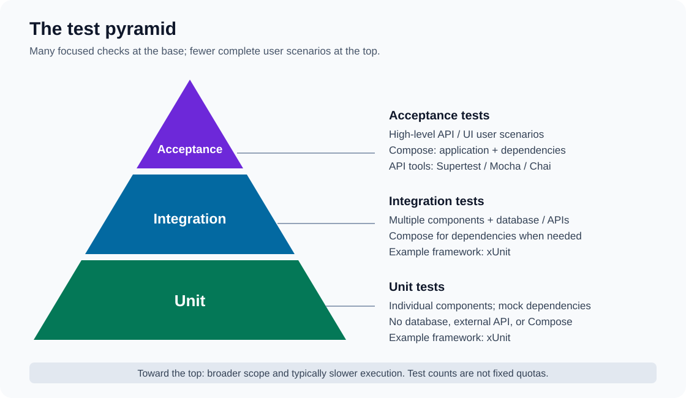

# Contributing

Keep changes focused on the value described in the issue. Discuss significant
scope or design changes before implementing them.

## Organizing work

- **User Story:** a capability that provides value to a user, including developers.
  Describe it as “As a …, I want …, so that …” and include observable acceptance
  criteria, preferably using Given/When/Then.
- **Bug:** behavior that differs from what is expected. Include reproduction
  steps, actual behavior, and expected behavior.
- **Task:** supporting implementation or investigation work. Link it as a
  sub-issue of the relevant story or bug when applicable. An investigation should
  state the question to answer and its expected outcome, such as a recommendation.
- Use **milestones** to group work for a release, such as `v0.1`.

Technical steps such as adding models, interfaces, or endpoints belong within
the story or its Tasks. Acceptance criteria describe outcomes from the user's
perspective; detailed validation cases belong in the tests.

## Definition of Ready (DoR)

A story is ready to start when:

- [ ] The intended user, capability, and benefit are clear.
- [ ] The scope and observable acceptance criteria are understood.
- [ ] The work is small enough to implement and review as a focused change, or
      has been broken into supporting Tasks.
- [ ] Dependencies and blockers are identified, and work can proceed.
- [ ] Open questions that prevent implementation have been resolved or have an
      investigation Task to resolve them first.

Implementation details may be decided during development. A story does not need
a complete technical design to be ready.

For Bugs and Tasks, use the same principles with a clear expected result rather
than requiring the user-story format.

## Development and pull requests

- Work on a branch and submit a pull request to `main`; do not commit directly
  to `main`. Use `feature/` or `bug/` prefixes for new branches.
- Keep commits small and logical. Use short, imperative commit subjects, such as
  “Add thread repository”.
- Reference the related issue in the PR and describe the resulting behavior and
  how it was verified. Follow the repository's PR template when present.
- Add or update tests at the appropriate level: unit tests for isolated behavior,
  integration tests for interactions, and acceptance tests for user-visible
  scenarios. Cover relevant validation and failure paths.
- Keep secrets and real user data out of source control, logs, and test fixtures.
- Update documentation when behavior, configuration, commands, or setup changes.

## Definition of Done (DoD)

A story, bug, or task is done when:

- [ ] The agreed scope is implemented and the acceptance criteria or expected
      outcome are verified.
- [ ] Applicable unit, integration, and acceptance tests have been added or
      updated, and all applicable test suites pass without regressions. See
      [Testing levels](#testing-levels) for their scope.
- [ ] API changes are reflected in the OpenAPI specification, including endpoints,
      request and response schemas, status codes, and RFC 9457 Problem Details.
      SSE endpoints document the event stream and event payloads where applicable.
- [ ] The implemented API behavior has been verified against the updated
      specification, including relevant validation and error responses.
- [ ] The build and all configured required CI checks pass, including applicable
      coverage, quality, security, and container checks.
- [ ] Changes that affect supported platforms have been verified on the platforms
      required by the repository; container checks run where supported.
- [ ] Documentation and configuration examples reflect the change where needed.
- [ ] The PR has been reviewed, feedback is resolved, and the change is merged
      into `main`.
- [ ] For changes that produce a distributable image, the versioned, tested and
      scanned image has been published successfully through the configured pipeline.
- [ ] The linked issue and supporting Tasks reflect the completed work.

Apply checks according to the change. Documentation-only changes require a
documentation review and any configured documentation checks, not application
tests. Investigation Tasks are done when their findings and recommendation are
recorded in the issue and any follow-up work is identified.

Until automated checks and publishing are available, record the relevant manual
verification and any unavailable checks in the PR. Do not claim checks passed
when they were not run.

## Testing levels

Use the test pyramid to guide the balance of tests: many focused unit tests,
fewer integration tests, and a smaller set of acceptance tests covering complete
user scenarios. The pyramid describes relative scope and effort, not a fixed
quota or coverage percentage.

### Unit tests

Test individual components in isolation, mocking all dependencies of the component
under test. Do not require a real database, external API, or Docker Compose.
Use xUnit for .NET projects, for example. Cover component behavior, relevant edge
cases, and failure paths.

### Integration tests

Test multiple components working together, including real database integration or
API calls where applicable. Docker Compose may be needed to start dependencies
such as a database. Use xUnit for .NET projects, for example. Verify interactions
across component boundaries, including relevant failure and validation behavior.

### Acceptance tests

Test high-level API and/or UI behavior against a running Docker Compose stack
containing both the application and its dependencies, such as the database.
Exercise user scenarios through the application's public interfaces. Use
Supertest, Mocha, and Chai for API acceptance tests; use browser tooling when UI
testing applies.

Choose the applicable levels for each change and record the verification in the
PR. Documentation-only changes do not require application tests. When a test
suite cannot run, state why rather than reporting it as passed.
